  

# Hi 👋, I'm Swayanshu Satyapragyan Sahoo

### 🚀 MCA Student | Java & Python Developer | Spring Boot Learner | Open to Internship

  

  

---

## 👨‍💻 About Me

🎓 MCA Student

💻 Passionate about Java Backend Development and Python

🌱 Currently learning Spring Boot, REST APIs and AI/ML

📍 Odisha, India

🚀 Building Java, SQL and Python Projects

🎯 Seeking Java/Python Internship Opportunities

## 🤝 Connect With Me

---

# 💻 Tech Stack

### 👨‍💻 Languages

### 🌐 Frontend

### 🗄️ Database

### ⚙️ Tools

### 📚 Currently Learning

---
## 🌟 Featured Projects

### 🌐 Portfolio Website

🛠 **Tech Stack:** HTML, CSS, JavaScript

📌 A responsive personal portfolio showcasing my skills, projects, and contact information.

🔗 **Repository:** https://github.com/swayanshu2004-hub/portfolio

🌍 **Live Demo:** https://swayanshu2004-hub.github.io/portfolio/

---

### 📝 Student Registration System

🛠 **Tech Stack:** HTML, CSS, JavaScript

📌 A responsive student registration system with a clean UI for managing student information.

🔗 **Repository:** https://github.com/swayanshu2004-hub/student-registration-system-html

🌍 **Live Demo:** https://swayanshu2004-hub.github.io/student-registration-system-html/

---

### 🍔 Food Delivery Database

🛠 **Tech Stack:** SQL, MySQL

📌 Designed and implemented a relational database for a food delivery system using tables, joins, aggregate functions, and SQL queries.

🔗 **Repository:** https://github.com/swayanshu2004-hub/food-delivery-database-sql

---

### 🏦 Banking Management System

🛠 **Tech Stack:** Java, OOP

📌 A console-based banking application supporting account creation, deposits, withdrawals, balance inquiries, and transaction management using Object-Oriented Programming.

🔗 **Repository:** https://github.com/swayanshu2004-hub/Banking-Management-System

## 🚀 Current Focus

- 🌱 Learning **Spring Boot** and **REST APIs**
- 💻 Building **Java** and **Python** projects
- 🧠 Practicing **Data Structures & Algorithms**
- 🗄️ Strengthening **SQL & Database Design**
- 🎯 Looking for **Java/Python Internship Opportunities**
---

# 📈 Contribution Graph

---

### 💡 Quote

> **"Code. Learn. Build. Repeat."**

⭐ Thanks for visiting my profile!

